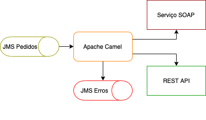

Exemplo de integração com Apache Camel

Fortemente baseado no curso da Alura: https://cursos.alura.com.br/course/camel

## Pré Requisitos:

- ActiveMQ com uma fila "pedidos"
- Serviço REST com operação de GET e operação de POST para receber as requisições (disponibilizado na pasta "webservice")

## Proposta
1. Obter informações de uma Fila JMS que contém diversos pedidos de livros.
1. Filtrar somente pedidos de livros do tipo "EBOOK".
1. Realizar chamada à uma API REST de persistência de Pedidos.
1. Realizar chamada à um WS SOAP contendo informações financeiras.
1. Tratar erros

